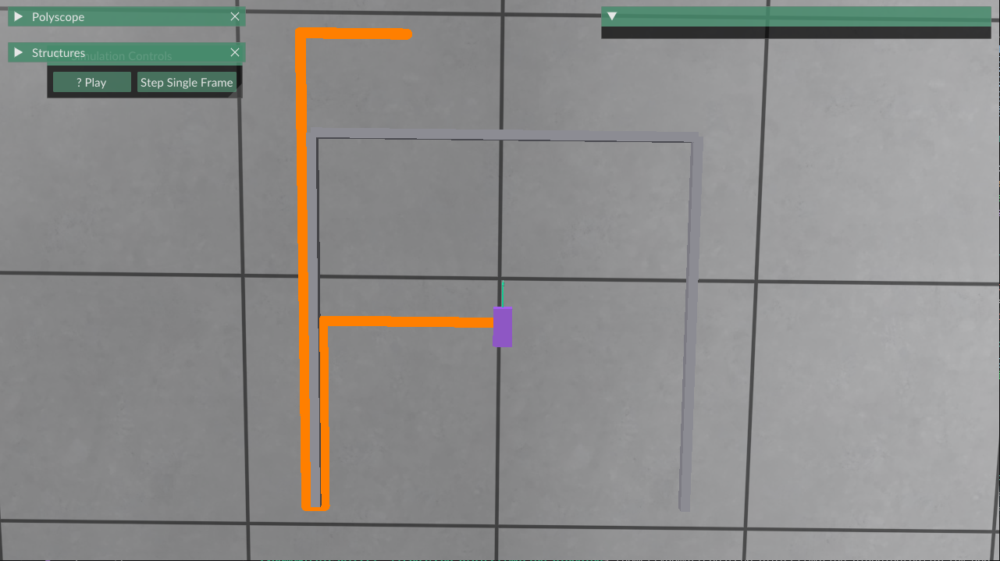

# Motion Planning

## Steps

1. Setup the project with libraries
    - **Eigen** (matrix math, transformations)
    - **Polyscope** (data visualizer / logging timeline)
    - **FCL / Flexible Collision Library** (geometric collision checking)

2. Build a 2D simulation
    - Kinematic Bicycle Model (vehicle constraints)
    - Static environment obstacles
    - Motion planner (Hybrid A\* or RRT*)

## Tools to learn

- **CMake** (project builds, `FetchContent` or `find_package`)
- **Vcpkg** (C++ dependency management)
- **AddressSanitizer (ASan)** (memory safety verification)

### Prerequisites

- need a `VCPKG_ROOT`-path defined

## Progess & Challenges

Currently we have a working version with breadth first search. It looks like this:

